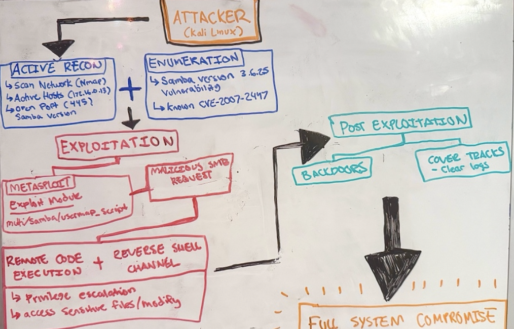
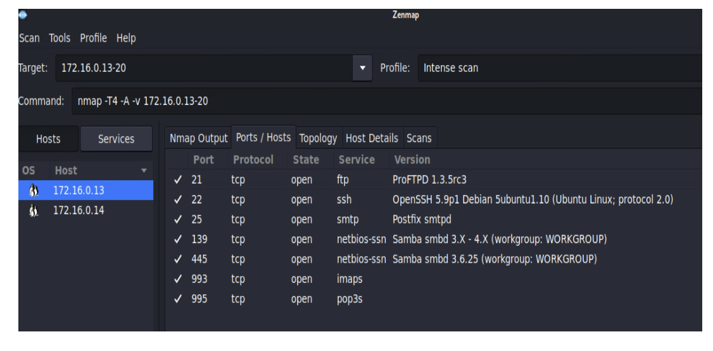
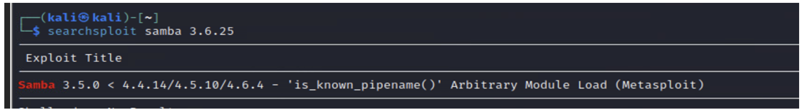
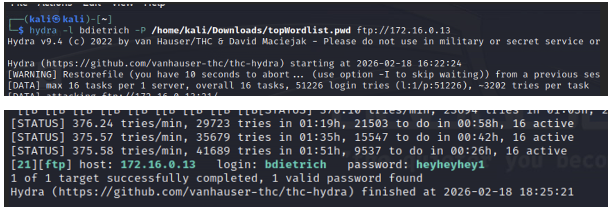
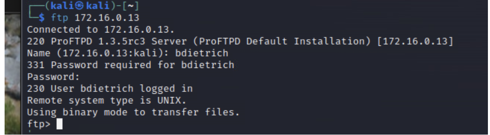
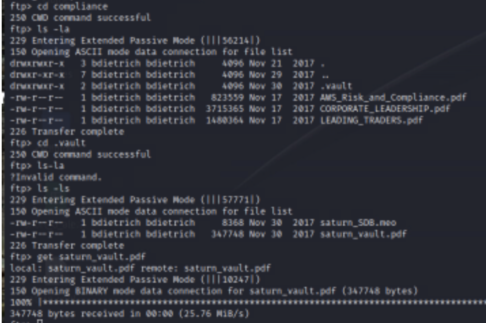
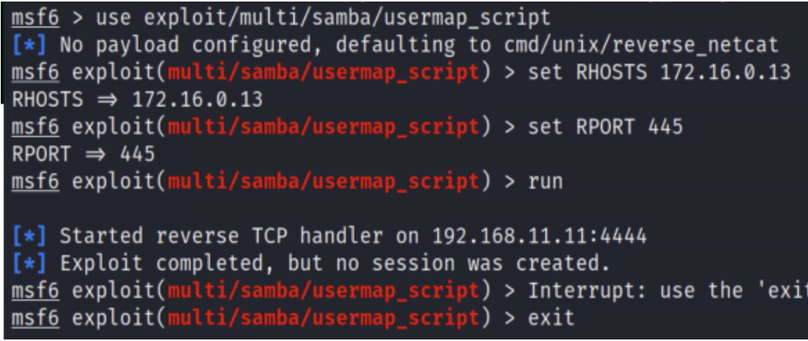
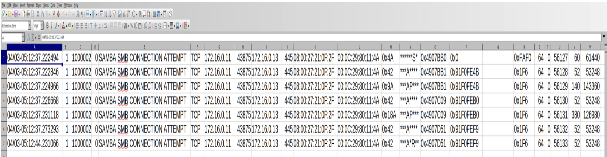
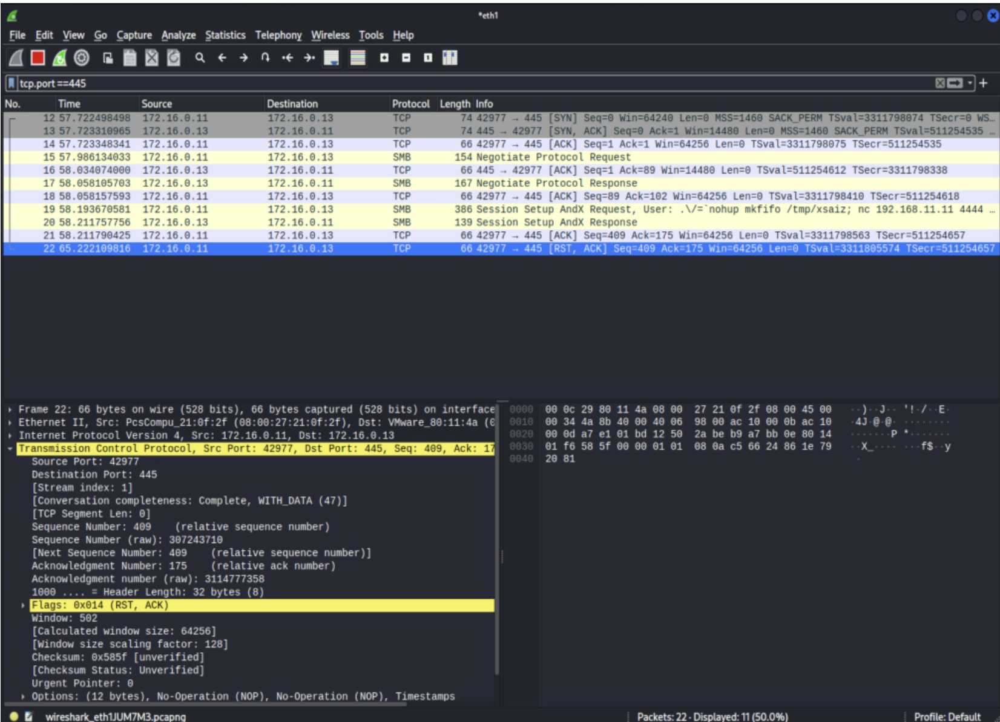

# Saturn Network Security Analysis

## Overview
This project simulates a real-world internal network security assessment using Kali Linux to identify, exploit, detect, and mitigate vulnerabilities within a controlled lab environment.

---

## Attack Workflow Overview

This diagram illustrates the end-to-end attack lifecycle, from reconnaissance to full system compromise and detection.

---

## Network Setup
- Attacker: Kali Linux (172.16.0.11)
- Targets:
  - 172.16.0.13 (FTP, SSH, SMB)
  - 172.16.0.14 (HTTP, SMB)

---

## Tools Used
- Nmap / Zenmap
- Searchsploit
- Hydra
- Metasploit
- Wireshark
- Snort IDS

---

## 1. Reconnaissance
Network scanning identified active hosts and exposed services.

---

## 2. Vulnerability Identification
Searchsploit was used to identify known vulnerabilities in OpenSSH and Samba services.

---

## 3. Exploitation (Credential Attack)
A password attack using Hydra successfully compromised user credentials.

---

## 4. Access & Data Exfiltration
Using compromised credentials, FTP access was obtained and sensitive files were discovered and downloaded.

---

## 5. Exploitation Attempt (Metasploit)
An attempt was made to exploit a known Samba vulnerability using Metasploit.  
No session was established, likely due to environmental constraints, demonstrating the need for alternative attack paths.

---

## 6. Detection (Snort IDS)
Custom Snort rules were created to detect SMB-based attacks. Alerts were successfully triggered during attack simulation.

Custom rules used in this project can be found in the `/snort-rules/snort-rules.txt` file.

---

## 7. Traffic Analysis (Wireshark)
Network traffic analysis confirmed SMB communication and attack-related activity.

---

## Key Takeaways
- Weak credentials can lead to full system compromise
- Multiple attack paths may be required when exploits fail
- Intrusion Detection Systems (Snort) provide visibility into malicious activity
- Network traffic analysis is critical for understanding attack behavior
- Layered security (attack + detection + analysis) is essential

---

## Project Structure 
- `/report` – full project documentation
- `/screenshots` – evidence of scans, attacks, and detections
- `/snort-rules` – custom detection rules
- `/exploitation` – password cracking and attack steps
